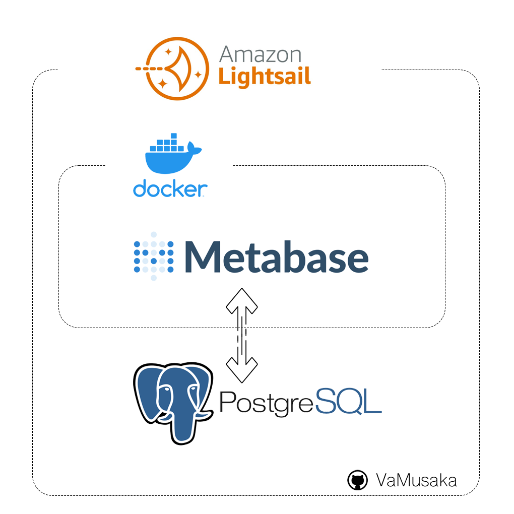
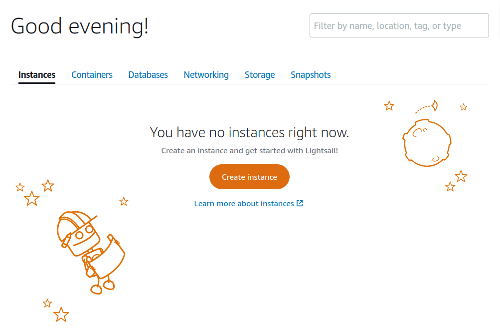
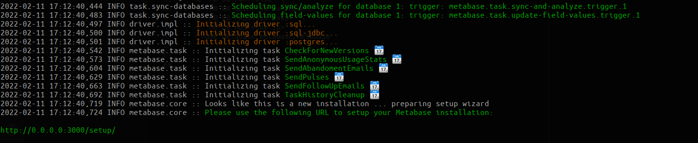
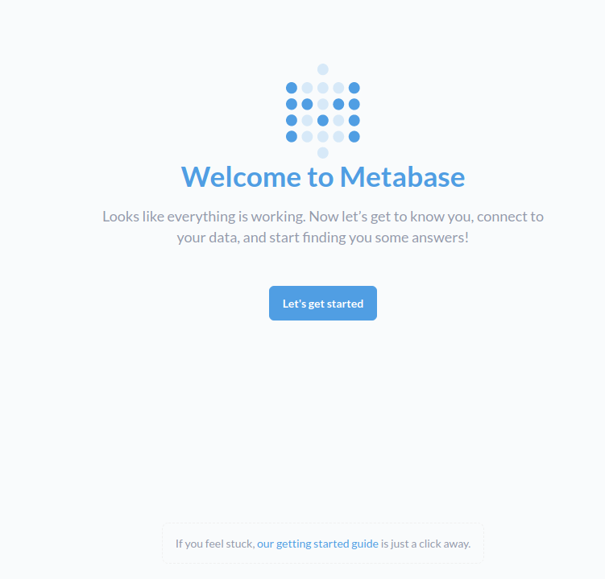

[](image.png)

# Running Metabase on AWS Lightsail

> I have searched the internet for a simple (open source) analytics platform that can be integrated with many data sources including MongoDB in particular. Also important to me was the interactivity and embedded analytics capabilities of the tools l looked into. I found Metabase to tick all the boxes and their pricing and open source offering made this even more attractive.

> Having played around with Docker before, I decided to test Metabase and look around using a local version. I managed to get this running in a matter of minutes. It quickly became clear after answering a few questions on the database l had connected that I needed a production version. To continue exploring without losing any of the work I had done I had 2 options as recommended in the install documentation, saving the data on mapped file storage or using a PostgreSQL database. I opted for the database option as it seemed simple enough. 

> Although the tutorial for deploying a new version of Metabase on Elastic Beanstalk is very extensive, I decided to go in a different direction.I opted to run Metabase on an AWS Lightsail Ubuntu instance, the reason for  this was simply that AWS Lightsail has always been a lot less  intimidating as compared to Amazon Elastic Compute Cloud (EC2) or the Metabase recommended Elastic Beanstalk. I have always found it easier to manage instances, networking as well as storage compared to EC2 or any other cloud compute providers. 

> In this article l go over the steps I followed to install Create the AWS Lightsail instance, installing Docker, PostgresQL and running Metabase connected to the postgres database. I will also include any hurdles that l faced during the install with the workarounds.

## Prerequisites 
> This article assumes some knowledge of the different listed technologies below although not essentials.
- <a href="https://aws.amazon.com/lightsail" target="_blank">AWS Lightsail</a>: A way to build applications and websites fast with low-cost, pre-configured cloud resources. We will use this to host Docker container with Metabase and also as a host for the PostgreSQL database.
- <a href="" target="_blank">Docker</a> : A software platform that allows you to build, test, and deploy applications quickly. This will be used to run the Metabase application.
- <a href="" target="_blank">PostgresSQL</a> :A powerful, open source object-relational database which we will use to store out Metabase (meta) data and configurations. This will allow us to update turn off and rebuild the docker container without losing our data.
- <a href="" target="_blank">Metabase </a> : An open source business intelligence tool that lets you create charts and dashboards using data from a variety of databases and data sources.

## Installation 
To get this all working below are the step by step instructions l followed. 
- Create an AWS Account
   
   Got to [AWS Console](aws.amazon.com) and create an account if you do not already have one. As a new user Amazon provides a free tier where you can create some resources for free without paying anything for the first year from the day you create an account. 

- Create an AWS Lightsail instance
   
    Once you account is ready head over to the [Amazon Lightsail](https://lightsail.aws.amazon.com/). 

    - On the lightsail page create a new instance by clicking the **Create Instance** button. 
 
    

    - Choose the instance location closest to you.
    - Pick your instance image 
      - Select platform **Linux/Unix**
      - Select a blueprint **Ubuntu 20.04 LTS**
        - create an ssh key if you do not already have one
    - Choose your instance plan
      - To get started l would recommend selecting the `2gb Ram, 1vCPU, 60gb SSD` instance. *(at the time of this article amazon are offering First 3 months free! on this instance size)* 
    - Identify your instance
      - Give your resource a unique name. 
  
    - Once you are happy with your settings **create instance**
    - When you create your instance take note of the Public IP that is attached to your instance. You will need this to check your installation of Metabase at the end of the installation. You can get this IP following the steps outlined in the article [IP addresses in Amazon Lightsail](https://lightsail.aws.amazon.com/ls/docs/en_us/articles/understanding-public-ip-and-private-ip-addresses-in-amazon-lightsail)


    > **NOTE:** Download the [article's directory](https://github.com/VaMusaka/anecdotes/tree/gh-pages/articles/metabase) with the `install.sh` should take care of all the steps described below without needing any extra configurations. 

    > This script will install docker, PostgresQL, setup the database user and enable docker access to the database as well as install and run the Metabase container.

    > To install with this method simple run `sudo ./install.sh`. Follow any instructions whenever prompted for input, 
    
Alternatively, follow the steps below to install and configure each component separately. 
- ### Install Docker
  - Connect to your instance via ssh 
   - Follow instructions to [Install Docker Engine on Ubuntu](https://docs.docker.com/engine/install/ubuntu/).
   - The same steps are scripted in the `src/docker.sh` file.
     - To install docker using this file simply run `sudo ./src/docker.sh`. 
     - This will remove any existing docker versions currently installed on your machine if any and install the latest version through the docker recommended install process. 
     - Once the install is finish this will also verify by running the `docker run hello-world` which will confirm that docker is installed. 

- ### Install PostgreSQL 
  - Based on my experience I would recommend using PostgreSQL to store your Metabase data;
  - To install this follow instructions on [How To Install PostgreSQL on Ubuntu 20.04 [Quick Start]](https://www.digitalocean.com/community/tutorials/how-to-install-postgresql-on-ubuntu-20-04-quickstart)
   - The same steps to install PostgreSQL are scripted in the `src/postgres.sh` file. 
     - To install PostgreSQL using this file simply run `sudo ./src/postgres.sh`. 
     - This will install the latest version of PostgreSQL.
  
- ### Database setup
   > ***NOTE*** - Steps below can be achieved by also running the supplied `sudo ./src/db_setup.sh`.
    
     - Now for the tricky part. Since the main purpose of using a Lightsail/EC2 instance to run Metabase is to have the database as well as the docker container on the same machine. We need to make sure that our PostgreSQL database is accessible from the Metabase Docker container. To achieve this we will need to modify a few PostgreSQL files and restart the service.   
     - The installed version of PostgresQL will by default not have access to listen on any address other than `localhost`. 
     - This will need to be changed to allow PostgreSQL to on any address by modifying the `/etc/postgresql/<version>/main/postgresql.conf` by updating the following line:
         ```
         #listen_addresses = 'localhost'
         ```
         to:  
         ```
         listen_addresses = '*'
         ```
     -   In addition to this, you will need to setup PostgresQL to be accessible from docker. When running a container Docker will assign an IP to a container from the range `172.17.0.1/16`, to allow connections to Postgres from this range of addresses modify the `/etc/postgresql/<version>/main/pg_hba.conf` by adding the following line if does not already exist. 
         ```
         host    all             all             172.0.0.1/32            trust
         ```

- ### Install Metabase
   - Once you have Docker and PostgreSQL installed its now time to get Metabase running.
   - From the [Running Metabase on Docker](https://www.metabase.com/docs/latest/operations-guide/running-metabase-on-docker.html) instructions follow the instructions on **Using Postgres as the Metabase application database** 
   - Before running the Metabase container we will need to setup a PostgreSQL user and password for metabase to use to connect. 
   - The file `/src/metabase.sh` will help to create the user and password as well as run the Metabase docker container to get this . 
   - Alternatively you can follow the steps below to setup the PostgreSQL account and run the Metabase Docker container. 

      - Create the PostgreSQL account.

         ```
         sudo -u postgres psql -c "CREATE USER <username> WITH PASSWORD <password>"
         ``` 
      
      - Set the account as a Super User in the database
         ```
         sudo -u postgres psql -c "ALTER GROUP Superuser ADD USER <username>"
         ```  

      - Run the 

         ```
         sudo docker run -d -p 80:3000 \
            --add-host host.docker.internal:host-gateway \
            -e "MB_DB_TYPE=postgres" \
            -e "MB_DB_DBNAME=metabase" \
            -e "MB_DB_PORT=5432" \
            -e "MB_DB_USER=<username>" \
            -e "MB_DB_PASS=<password>" \
            -e "MB_DB_HOST=<host_private_ip>" \
            --name metabase metabase/metabase
         ``` 
      
       - To check the progress you can check the progress by checking the logs every couple of seconds 
         ```
            docker logs metabase
         ``` 
     - Once complete the logs should show the message below 
      

- Using your Lightsail's public IP Address noted after creating your instance, confirm that metabase is up and running from your browser http://{IP}/setup. If everything is set up correctly page should show a metabase welcome message as shown below. 
   


>  Finally this is the stage you get to enjoy your installation. One of the things l have loved about Metabase so far is the ease of use and the fact that to explore and really get hands on you do not need any hand holding. 

> At this point all you will need is to connect to your data source and Metabase provides a guided interface to get your first database source connected which is very easy.

> Creating visualizations is also equally as easy but do not take my word for it, go ask your questions, learn about your data. 
